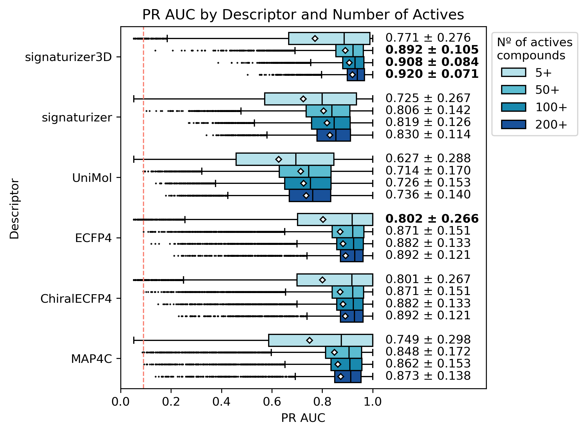

# Benchmarking Exercise for Target Compound Predictions

This repository contains code for benchmarking target compound predictions using different molecular descriptors. Amongst these is [Signaturizer3D](https://www.biorxiv.org/content/10.1101/2024.03.15.584974v1) which leverages stereochemical data to infer small molecule bioactivity signatures.

## Introduction
In this exercise, we aim to compare the performance of various molecular descriptors in predicting target compounds. 

Molecular descriptors here evaluated are:
* signaturizer
* signaturizer3D
* ECFP4
* ChiralECFP4
* MAP-C
* Uni-Mol

## Datasets
[ChemicalChecker](https://www.nature.com/articles/s41587-020-0502-7) data on compound target data (~4k targets ~600k compounds) has been used as the benchmarking dataset. This corresponds to "B4" bioactivity space. 

## Model Training
All models were trained using XGBoost (default parameters) and using identical train/test sets with only varying molecular descriptors. 5-fold CV was used to analyze model performance - no validation set was stored due to many targets lacking sufficient actives for this stratergy. 

## Evaluation
Standard metrics where evaluated - ROC AUC, PR AUC, Precision, Recall, MCC, F1-Score, Accuracy & Balanced Accuracy. Given data imbalances special emphasis on PR AUC as main metric to look at. 

## Results

Precision-Recall AUC evaluation of models using different descriptors for target w/ 5+, 50+, 100+ & 200+ active compounds. For targets w/ 50+ active compounds Signaturizer3D shows a higher performance. Expected random is <0.1 for all models.